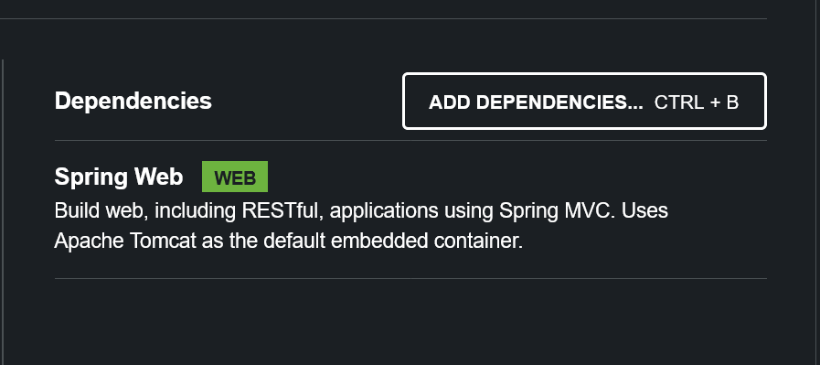

You might have already an application to work with, but in this guide we're going to use a simple
application and we're going to guide you through the process to create a Spring Boot application ready to
be used in Azure Spring Apps. You can learn more of the process in [spring.io](spring.io)


1. Create app on start.spring.io
   Keep all the defaults
   

1. Then just add the Spring Web Dependency
   

   **NOTE** I think we can avoid all this if we just add this minimal code to the Workshop Image. Then they can avoid start.spring and we can open a page in an editor

1. For the code it will be really ugly but also really simple. 

   ```java
   //these need to be added
   import org.springframework.web.bind.annotation.RequestMapping;
   import org.springframework.web.bind.annotation.RestController;

   // Add the RestController Annotation
   // This let's us respond at / with a string
   // REMEMBER - this is not a good pattern to use for a normal application
   @RestController
   @SpringBootApplication
   public class DemoApplication {

      public static void main(String[] args) {
         SpringApplication.run(DemoApplication.class, args);
      }

      // Add this whole section which defines what to do when the user requests
      // the base URL of our website.
      @RequestMapping("/")
      public String helloSpring(){
         return "hello spring";
      }

   }
   ```

   **NOTE** Make sure to emphasize this is for instructional purposes only and only to demonstrate how to work with ASA-E

2. Run it locally.....


Now you should be ready to move your application into Azure Spring Apps.