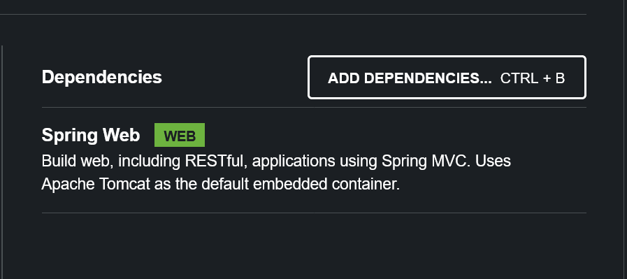

## Prerequisites

This guide assumes you know Spring, but you are not that familiar with Azure or Azure Spring Apps Enterprise (ASA-E). If you have limited experience with ASA-E we recommend you read a [basic document](https://onevmw-my.sharepoint.com/:w:/g/personal/spousty_vmware_com/EZq6t15kvZJEmM11jSrGYI0BNVg2ejUT-x9DRTHAZUOV9w?e=WQkBsF) basic Azure terminology. If you want to go deeper you can do the [course AZ-900T00](https://docs.microsoft.com/en-us/training/courses/az-900t00), especially the last 2 modules.

It is also important to understand that, for Azure Spring Apps, the web interface is primarily read-only. You can do some very basic high-level resource creation but the majority of your work has to happen through either the command line or IDE plugin ([VSCode](https://code.visualstudio.com/docs/azure/extensions) and [Intellij](https://plugins.jetbrains.com/plugin/8053-azure-toolkit-for-intellij)). Due to this architecture, there will not be many web screenshots until we get to features such as monitoring or logging.

There are separate how-to guides for Intellij and VScode that cover how to use the IDE plugins with Azure.

* [Intellij Azure Spring Apps](https://docs.microsoft.com/en-us/azure/spring-apps/how-to-intellij-deploy-apps) specific
* [Intellij general Azure usages](https://docs.microsoft.com/en-us/azure/developer/java/toolkit-for-intellij/)
* [VS Code Azure Spring Apps](https://code.visualstudio.com/docs/java/java-spring-apps) specific
* [VS Code general Azure usages](https://code.visualstudio.com/docs/azure/extensions)

We also assume you have a JVM > version 8 and Maven already installed on your machine. They should already be set up and working in any terminal where you plan to use the Azure CLI.

Finally, we also assume you have logged in Azure from the CLI or IDE.  For the CLI, if you top

```shell
$ az account show
```
If you have not logged in you should be prompted to login. If you are logged in, the response should be some JSON that contains your Subscription ID, Name, and other fields.

TODO[[[Put in a screenshot and text for intellij login]]]

With those preliminaries out of the way, let's deploy your Spring Application on ASA-E.

## Creating the Application

We are going to create just enough application that you can learn the terminology and basic mechanics of using ASA-E for your applications. In later modules we will go into more depth.

TODO[[[Pet clinic is no good - this app will be super simple the whole way and not do anything real]]]
1. Login - because we can't open an iframe for the portal
   `az login --use-device-code`
   https://learn.microsoft.com/en-us/cli/azure/reference-index?view=azure-cli-latest#az-login

2. ResourceGroup
   ` az group create -l westus -n playing1`
   https://learn.microsoft.com/en-us/cli/azure/group?view=azure-cli-latest#az-group-create

3. Spring App Service
   `az spring create -n the-asa-service -g playing1 --sku Enterprise  --enable-gateway --enable-api-portal`
   https://learn.microsoft.com/en-us/cli/azure/spring?view=azure-cli-latest#az-spring-create
   Same as spinning up any service in Azure - in this case we are spinning up resources that know how to host Spring, and other language runtimes.
   Enterprise also makes it possible to add frequently used technology, such as an API portal, to the resources spun up.

This is kinda cool to set the defaults so you don't have to keep entereing it.
```shell
az configure --defaults \
    group=${RESOURCE_GROUP} \
    location=${REGION} \
    spring=${SPRING_APPS_SERVICE}
```

4. Create app on start.spring.io
   Keep all the defaults
   

5. Then just add the Spring Web Dependency
   

I think we can avoid all this if we just add this minimal code to the Workshop Image. Then they can avoid start.spring and we can open a page in an editor

6. For the code it will be really ugly but also really simple. Make sure to emphasize this is for instructional purposes only and only to demonstrate how to work with ASA-E

```java
//these need to be added
import org.springframework.web.bind.annotation.RequestMapping;
import org.springframework.web.bind.annotation.RestController;

// Add the RestController Annotation
// This let's us respond at / with a string
// REMEMBER - this is not a good pattern to use for a normal application
@RestController
@SpringBootApplication
public class DemoApplication {

	public static void main(String[] args) {
		SpringApplication.run(DemoApplication.class, args);
	}

    // Add this whole section which defines what to do when the user requests
    // the base URL of our website.
	@RequestMapping("/")
	public String helloSpring(){
		return "hello spring";
	}

}
```

7. Not sure I want them to run it locally - not sure that is important, though it is simple to do
8.  First create the app with nothing it in
    `az spring app create -n springapp -s the-asa-service -g playing1  --assign-endpoint true --cpu 2 --memory 3`

9. Now we package it up on our end and deploy it to the app we created
   `az spring app deploy -n springapp --artifact-path target/demo-0.0.1-SNAPSHOT.jar -s the-asa-service -g playing1`


If you area already familiar with Azure Spring Apps concepts and terminology feel free to skip
this module. This page is intended to help developer new to Azure understand some of the common concepts and terms


NOTE FOR AUTHORS The pages are based on this outline
https://onevmw-my.sharepoint.com/:w:/g/personal/spousty_vmware_com/EfM2l_jNwS5ErTm0H_JNpTEByE57Wd-nFMGw3TBDxbMMLw